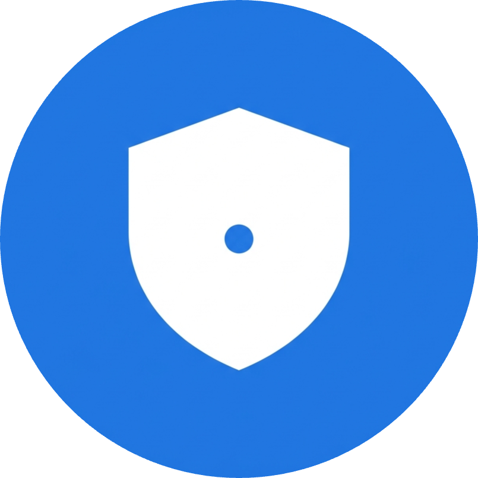
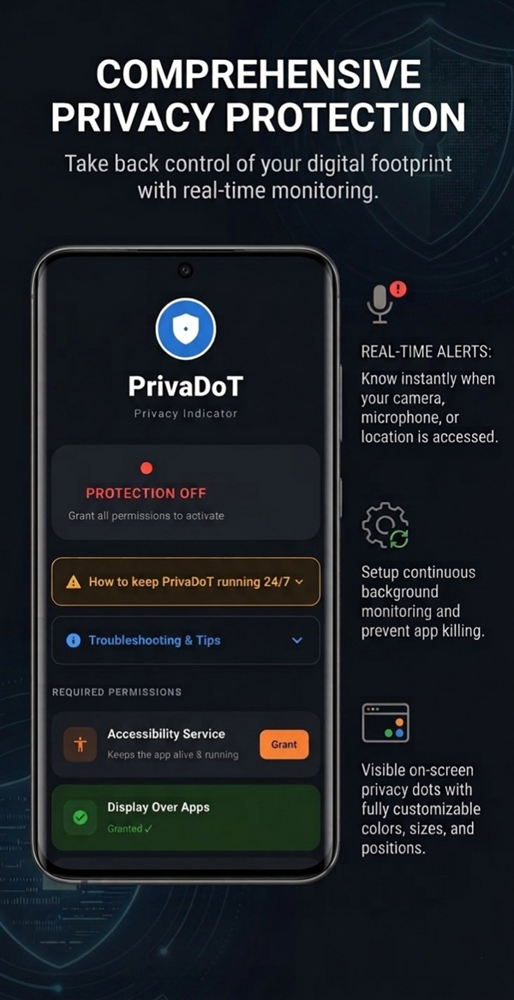
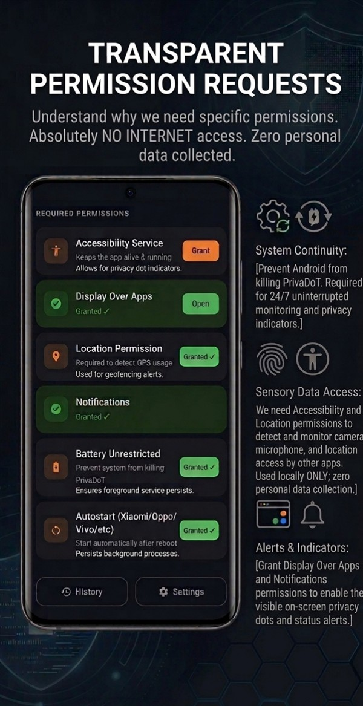
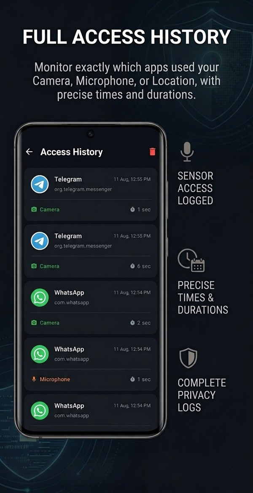
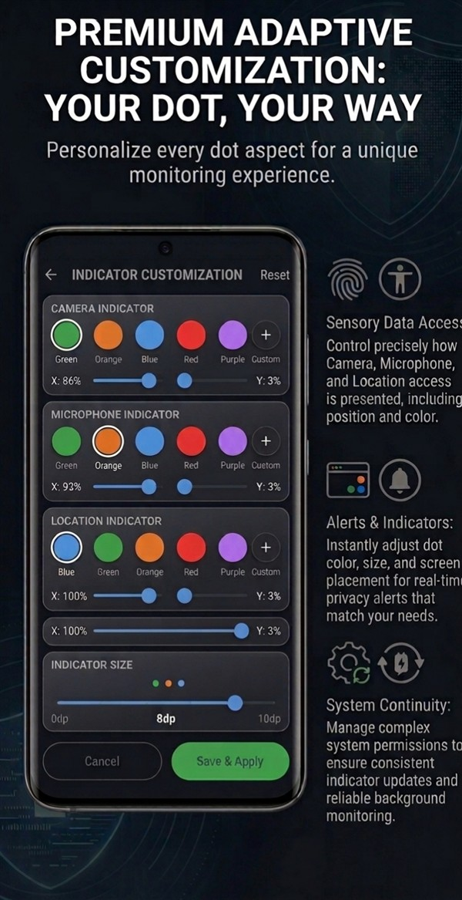
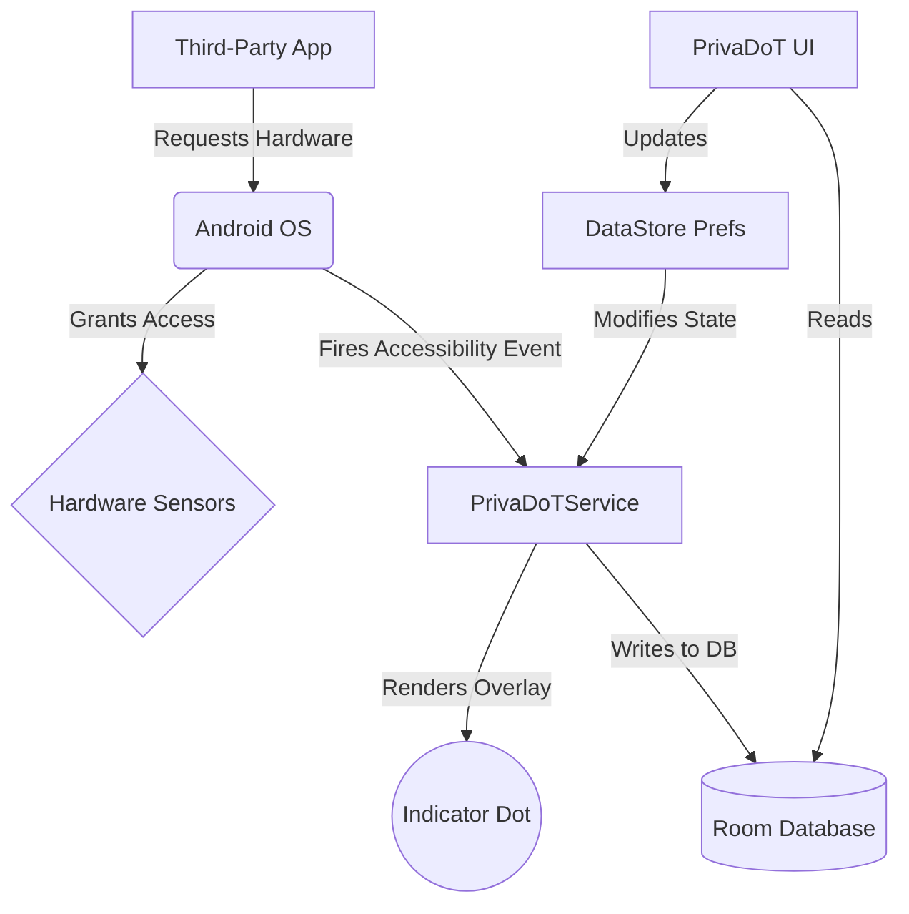

<div align="center">



# PrivaDoT
**Next-Generation Privacy Indicator for Android**

[](https://developer.android.com)
[](https://github.com/InvisusNova/PrivaDoT/actions)
[](https://developer.android.com)
[](LICENSE)
[](https://github.com/InvisusNova/PrivaDoT)
[](https://github.com/InvisusNova/PrivaDoT/stargazers)
[](https://github.com/InvisusNova/PrivaDoT/network/members)

*Empowering users with real-time transparency. Know exactly when your device's most sensitive hardware is being accessed, right when it happens.*

[Features](#-core-features) • [Screenshots](#-interface) • [Architecture](#-architecture--data-flow) • [Installation](#-installation--build)

</div>

---

## ⚡ Why PrivaDoT?

While modern operating systems (like Android 12+) have started including basic privacy indicators, **millions of older devices are left completely unprotected and blind** to background spying. 

**PrivaDoT** solves this by bridging the gap:
1. **Universal Protection:** Brings modern iOS 14+ / Android 12+ style privacy indicators to *all* Android devices (down to Android 7.0), ensuring everyone has the right to privacy, regardless of their phone model.
2. **Beyond the Basics:** Even on newer devices, native indicators lack historical tracking and customization. PrivaDoT provides an aggressive, always-on, zero-telemetry solution with an immutable audit log, giving you absolute control over your privacy.

## 📸 Interface

<div align="center">



<br>



</div>

## 🛡️ Privacy Commitment

> [!IMPORTANT]
> **PrivaDoT is a 100% Offline Application.** The internet permission (`android.permission.INTERNET`) is strictly omitted. It is physically impossible for this app to transmit your data anywhere.

- 📦 **Offline Sandbox:** All access history logs are stored securely via encrypted local SQLite (`Room`).
- 🛑 **Zero Telemetry:** No crashlytics, no analytics, no third-party tracking SDKs.
- 📖 **Open Source:** Every single line of code is completely auditable by the community.

## ⚖️ Privacy Policy & Terms of Use

By using **PrivaDoT**, you agree to the following terms and our unwavering privacy guarantees:

### 1. Absolute Zero Data Collection
**PrivaDoT** does **NOT** collect, transmit, upload, or share any personal data, device identifiers, location data, or usage statistics. The application operates entirely offline and is physically restricted from accessing the internet (the `android.permission.INTERNET` permission is completely omitted from the AndroidManifest).

### 2. Local Storage Only
All hardware access logs (camera, microphone, location history) are stored exclusively within a private local SQLite database (`Room`) on your physical device. This data never leaves your phone and can be completely wiped at your command.

### 3. Open Source Transparency
This software is provided under the MIT License as a 100% open-source project. You are encouraged to audit the source code to verify our zero-telemetry claims. There are no hidden third-party tracking SDKs, no crash analytics, and no backdoors.

### 4. Disclaimer of Liability
PrivaDoT is designed to enhance your awareness of background hardware usage. However, it is provided "AS IS" without warranties of any kind. InvisusNova and the contributors are not liable for any bypassed detections (e.g., highly sophisticated malware or OEM-level rootkits) or any damages arising from the use of this software.

## 🚀 Core Features

- **Real-Time Indicators:** Instant visual feedback when hardware is active.
  - 🟢 `Camera` - Active capture detection
  - 🟠 `Microphone` - Audio recording detection
  - 🔵 `Location` - GPS / Network location polling
- **Hardware-Level Call Detection:** Employs advanced `AudioManager` event-driven polling to instantly detect microphone usage even during native cellular phone calls, bypassing OEM dialer stealth techniques.
- **Immutable Audit Log:** Detailed history of which app accessed what, down to the exact millisecond.
- **Dynamic Positioning:** Freely move indicators via X/Y axis sliders to prevent UI overlap.
- **Auto-Boot Protection (`BootReceiver`):** Automatically starts background protection the moment you restart your phone.
- **Anti-Kill Engine (`KeepAliveService`):** Aggressively fights OEM battery optimizations to ensure the service is never silently killed in the background.

## ⚙️ Architecture & Data Flow



## 📂 Project Structure

```text
app/src/main/java/com/invisusnova/privadot/
├── data/                  # Local Storage Layer
│   ├── AppDatabase.kt     # Room Database Configuration
│   ├── HistoryDao.kt      # Data Access Object for logs
│   ├── HistoryEntity.kt   # SQLite Table schema for access events
│   └── SettingsManager.kt # Jetpack DataStore for user preferences
├── service/               # Core Background Engine
│   ├── BootReceiver.kt      # Auto-starts protection on device reboot
│   ├── KeepAliveService.kt  # Foreground service to prevent OS battery kills
│   ├── OverlayManager.kt    # SYSTEM_ALERT_WINDOW logic for drawing dots
│   ├── PrivaDoTService.kt   # Core AccessibilityService implementation
│   └── SensorUsageDetector.kt # Algorithms to detect Camera/Mic/Location
├── theme/                 # Jetpack Compose Material 3 UI Tokens
├── MainActivity.kt        # Primary Dashboard & Navigation Host
├── HistoryScreen.kt       # UI for viewing the immutable audit log
└── SettingsScreen.kt      # UI for customizing indicator X/Y positions & colors
```

## 🛠️ Tech Stack

PrivaDoT is built using modern Android development standards:

- **100% Kotlin:** Leveraging Coroutines and Flow for asynchronous operations.
- **Jetpack Compose:** Fully declarative, responsive UI with Material Design 3.
- **Architecture:** MVVM (Model-View-ViewModel) with strict separation of concerns.
- **Persistence:** Room Database for logs, Jetpack DataStore for asynchronous user preferences.

## 📥 Installation & Build

### Prerequisites
- Android Studio Ladybug (or newer)
- JDK 17
- Android SDK 36

### Building from Source

```bash
# Clone the repository
$ git clone https://github.com/InvisusNova/PrivaDoT.git

# Navigate to directory
$ cd PrivaDoT

# Build the debug variant
$ ./gradlew assembleDebug
```
*The output APK will be located at: `app/build/outputs/apk/debug/app-debug.apk`*

<details>
<summary><b>🔍 View Required Permissions (Expand)</b></summary>
<br>

| Permission | Purpose |
|------------|---------|
| `SYSTEM_ALERT_WINDOW` | Required to draw the indicator overlay seamlessly on top of other running apps (`OverlayManager`). |
| `BIND_ACCESSIBILITY_SERVICE` | Core engine. Allows `PrivaDoTService` to listen for passive hardware access events triggered by the OS. |
| `ACCESS_FINE_LOCATION` | Required *only* to detect when other apps are requesting location data. PrivaDoT itself does not use your location. |
| `QUERY_ALL_PACKAGES` | Allows the app to resolve package names (e.g., `com.whatsapp`) into human-readable app names and fetch their icons for the history log. |
| `POST_NOTIFICATIONS` | Ensures `KeepAliveService` remains alive via a foreground notification. |
| `RECEIVE_BOOT_COMPLETED` | Allows `BootReceiver` to restart the app after the phone restarts. |

</details>

> [!NOTE]
> Despite requiring `ACCESS_FINE_LOCATION`, PrivaDoT only **detects** when *other* apps request your location. It never accesses your actual GPS coordinates.

---

<div align="center">
  <b>Architected with ❤️ by <a href="https://github.com/InvisusNova">InvisusNova</a></b><br>
  If you find this project valuable, consider leaving a ⭐
</div>
